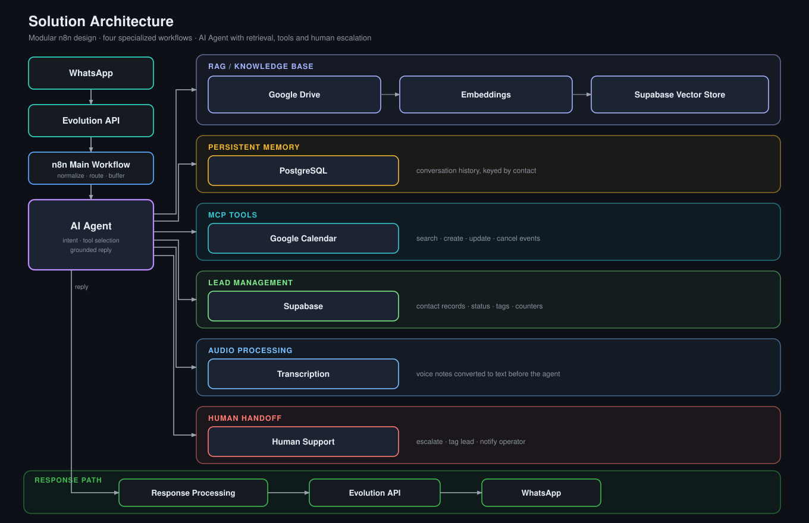

# AI WhatsApp Customer Service Agent

> Production-oriented AI customer service architecture for WhatsApp using n8n, RAG, MCP and human handoff.

A **modular, event-driven architecture** for automating customer service on
WhatsApp with an AI agent, designed for real operational scenarios. It receives
text and voice messages, answers from a maintained knowledge base using
retrieval-augmented generation, performs appointment operations through calendar
tools exposed over the Model Context Protocol, keeps per-contact conversational
state, tracks leads, and escalates to a human through a dedicated flow — delivered
as **four independently deployable n8n workflows** with explicit interfaces
between them.


**Quick links:** [Architecture](#architecture) · [Workflows](#workflows) · [How It Works](#how-it-works) · [Production-Oriented Design](#production-oriented-design) · [Setup](#setup) · [Technical spec »](docs/HOW_IT_WORKS.md)

---

## Overview

**Business problem.** Inbound customer service on WhatsApp is high-volume,
repetitive, and time-sensitive. Most questions are answerable from known company
information; many requests are appointment operations (book, reschedule, cancel);
a minority genuinely need a human. Handling this manually does not scale, and a
naive bot that "just calls an LLM" invents facts, loses context between messages,
and cannot take real actions.

**Implemented solution.** An n8n-based system where an LLM **agent** sits behind a
disciplined orchestration layer:

- inbound events are validated, de-duplicated, and normalized before anything else runs;
- rapid-fire message fragments are buffered and consolidated into a single turn;
- the agent answers **only** from retrieved knowledge or explicit tool results;
- appointment actions go through calendar **tools** and require customer confirmation;
- anything out of scope is routed to a human, after which automated replies stop.

**Role of the agent.** The agent is an orchestrated decision-maker, not the whole
system. It classifies intent, decides which tool to call, grounds its answer in
retrieved context or tool output, and produces the customer-facing reply. State,
delivery, knowledge ingestion, and escalation are handled by the surrounding
workflows.

**What is claimed.** Repetitive questions and routine scheduling are handled
without human involvement; conversation context is preserved across messages and
sessions; the knowledge base is updated by dropping a document in a folder; and
escalation is deterministic and carries full context. *No volume, latency,
deflection-rate, or accuracy figures are claimed — none are measured in this
repository.*

---

## Architecture



The solution is split into **four specialized n8n workflows**. This decouples
responsibilities — message orchestration, knowledge ingestion, scheduling tools,
and human escalation — so each component can be deployed, versioned, and evolved
independently, communicating only through small, explicit interfaces (an HTTP
webhook, an MCP endpoint, a sub-workflow call, and a shared vector table).

**Layers**

- **Inbound channel** — the customer, WhatsApp, and the Evolution API gateway that
  delivers events to n8n.
- **Orchestration** — webhook intake, validation and normalization, lead upsert,
  text/audio routing, audio transcription, and the Redis buffer/debounce.
- **AI & knowledge** — the AI Agent plus its LLM, RAG retrieval tool, embeddings,
  MCP client tool, calculator, and human-handoff tool.
- **External tools** — the MCP server workflow and the Google Calendar operations
  behind it.
- **Persistence** — PostgreSQL (chat memory), Supabase / `pgvector` (knowledge),
  Supabase `leads` (lead store), Redis (per-contact buffer).
- **Human support** — the handoff sub-workflow: tag the lead, notify the operator.
- **Response path** — response processing, presence, and delivery back through the
  Evolution API to WhatsApp.

A component-level walkthrough with a Mermaid system diagram is in
[`docs/ARCHITECTURE.md`](docs/ARCHITECTURE.md); a more detailed layered diagram is
in [`docs/images/architecture-overview.svg`](docs/images/architecture-overview.svg);
the node-level technical specification is in
[`docs/HOW_IT_WORKS.md`](docs/HOW_IT_WORKS.md).

---

## Workflows

The sanitized workflow exports live in [`workflows/`](workflows/).

| Workflow | Responsibility |
|---|---|
| **Main AI Agent** — [`ai-agent-main.json`](workflows/ai-agent-main.json) | Message processing and normalization; lead management (create / update in Supabase `leads`); conversation memory (PostgreSQL, keyed by contact); the AI Agent and its tool-selection decisions; and response processing (splitting the reply, presence, delivery) — or escalation when the agent calls the handoff tool. |
| **RAG Knowledge Base** — [`rag-knowledge-base.json`](workflows/rag-knowledge-base.json) | Document ingestion from a watched Google Drive folder: download and text extraction, splitting by heading then recursive chunking, embeddings, and insertion into the Supabase vector store. Idempotent per file (previous chunks are deleted before re-insert). |
| **MCP Calendar Tools** — [`calendar-mcp-tools.json`](workflows/calendar-mcp-tools.json) | Calendar availability lookup, event creation, event update, and event cancellation on Google Calendar — exposed to the agent as tools over an MCP server endpoint (n8n MCP trigger), consumed by the main workflow through an MCP client tool. |
| **Human Handoff** — [`human-handoff.json`](workflows/human-handoff.json) | Escalation of a conversation to human support: update the lead status/tag in Supabase and send a WhatsApp notification (reason and context) to the operator. |

---

## How It Works

1. A customer sends a WhatsApp message.
2. The Evolution API forwards the event to the n8n main workflow's webhook.
3. The workflow normalizes the payload, drops messages sent by the business
   itself, applies the reset-keyword check, and upserts the lead.
4. Text is used as-is; voice notes are converted to binary and transcribed to
   text. If the lead is already tagged for human service, the message is recorded
   to memory only and the agent does not run.
5. Fragments are buffered per contact in Redis and, after a short settle window,
   joined into a single prompt (debounce).
6. The AI Agent evaluates context and intent with PostgreSQL memory and its tools.
7. Knowledge questions are answered via RAG retrieval from the Supabase vector
   store.
8. Scheduling requests use the MCP calendar tools (Google Calendar), with an
   explicit customer confirmation before any create / update / cancel.
9. Conversation context is persisted; complex or sensitive cases are escalated to
   a human via the handoff sub-workflow.
10. The response is processed (split into parts, presence, send) and returned to
    WhatsApp through the Evolution API.

Full detail — state transitions, error paths, and per-component responsibilities —
is in [`docs/HOW_IT_WORKS.md`](docs/HOW_IT_WORKS.md).

---

## Production-Oriented Design

The architecture is built around the concerns that matter when an AI-driven
service runs against real traffic:

- **Persistent conversation memory** — chat history in PostgreSQL, keyed by
  contact, available to the agent and survivable across restarts.
- **Retrieval-Augmented Generation (RAG)** — answers about the business are
  grounded in retrieved knowledge-base chunks, not model recall.
- **External tool integration** — the agent acts on the world (calendar, lead
  store, escalation) through explicit tools, not free-form output.
- **MCP-based tool orchestration** — scheduling capabilities are exposed over the
  Model Context Protocol, decoupling the agent from the calendar implementation.
- **Lead management** — every contact is tracked (status, tags, counters,
  last-interaction) in a dedicated store.
- **Audio processing** — voice notes are transcribed to text before the agent, so
  one reasoning path serves both channels.
- **Controlled execution of actions** — the agent runs one tool at a time and
  reacts to each result before deciding the next step.
- **Explicit confirmation before critical operations** — no calendar create,
  update, or cancel happens without a summary shown and an explicit customer
  confirmation.
- **Human escalation** — a deterministic path tags the lead and notifies the
  operator with full context; automated replies then stop for that contact.
- **Modular workflow architecture** — four workflows with small, explicit
  interfaces; independent deploy, versioning, and scaling.
- **Anti-hallucination rules** — the agent prompt forbids inventing prices,
  services, hours, or availability, and requires deferring to the team when the
  knowledge base has no answer.
- **Separation of knowledge retrieval and transactional actions** — reading
  context (RAG) and changing state (calendar, leads, handoff) are distinct paths
  with different guarantees.

### Design decisions

- **Redis buffer + debounce** consolidates a burst of quick messages into one
  complete prompt and suppresses duplicate processing.
- **RAG as a separate workflow** lets the knowledge base be re-chunked and
  re-embedded without touching or redeploying the agent, and keeps the
  delete-then-reinsert idempotency logic off the request path.
- **MCP for scheduling** means the agent calls a capability, not an
  implementation, so the calendar layer can change or be reused independently.
- **Handoff as its own flow** keeps escalation deterministic, reusable, and
  isolated from the conversational path.

### Not included

This repository ships a production-oriented **architecture**, not a turnkey
deployment. There is no automated test suite, no global error-handling / retry /
dead-letter workflow, and no structured logging, metrics, tracing, or alerting.
Those are prerequisites before any deployment can be called "production-ready".

---

## Core Capabilities

Only capabilities present in the workflow definitions are listed.

| Capability | How it is implemented |
|---|---|
| **WhatsApp customer service** | Inbound events via an Evolution API webhook; outbound replies and a "typing…" presence via Evolution API message nodes. |
| **Supported message types** | Text (`conversation`) and voice (`audioMessage`), separated by an explicit router. Other types are not handled. |
| **Audio transcription** | Voice notes are converted from base64 to binary and transcribed with a Gemini 2.5 Flash audio model before entering the agent. |
| **Message buffering & debounce** | Each fragment is pushed to a per-contact Redis list; after a 10-second wait the flow proceeds only if the last buffered message is unchanged, so bursts become one turn. |
| **Persistent conversational memory** | Chat history is stored in PostgreSQL, keyed by the contact's phone number, and is available to the agent as memory. |
| **Retrieval-augmented generation** | The agent has a Supabase vector-store retrieval tool (`retrieve-as-tool`) over a `documents` table, with Google Gemini embeddings. |
| **Knowledge ingestion** | A separate workflow watches a Google Drive folder and keeps the vector store in sync (idempotent re-ingestion per file). |
| **Tool integration via MCP** | Scheduling is a standalone MCP server; the main workflow consumes it through an MCP client tool. |
| **Appointment management** | Calendar tools for **search, create, update, and delete** events on a Google Calendar. |
| **Lead management** | Contacts are upserted into a Supabase `leads` table (name, phone, status, tags, message count, last interaction). |
| **Human handoff** | An agent tool invokes a sub-workflow that tags the lead and notifies the operator with reason and context. |
| **Anti-hallucination rules** | The agent system prompt forbids inventing prices, services, hours, or availability, and requires consulting the knowledge base or deferring to the team. |
| **Confirmation before critical actions** | The prompt requires an explicit customer confirmation and a summary before any create / update / delete on the calendar. |
| **Post-handoff guard** | Once a lead is tagged for human service, the main workflow routes new messages to a memory-only branch instead of the agent. See [Limitations](#limitations-and-roadmap). |

---

## Technology Stack

| Technology | Responsibility | Architectural layer |
|---|---|---|
| **n8n** (+ LangChain nodes) | Workflow orchestration, agent runtime, tool wiring | Orchestration / AI |
| **Evolution API** | WhatsApp send / receive / presence | Inbound & outbound channel |
| **OpenAI** (`gpt-5-mini`) | Agent chat model | AI |
| **Google Gemini** (`gemini-2.5-flash`) | Audio transcription | Orchestration (pre-agent) |
| **Google Gemini embeddings** | Vectorization of documents and queries | AI / knowledge |
| **Supabase** (PostgreSQL + `pgvector`) | Vector store (`documents`) and lead table (`leads`) | Persistence |
| **PostgreSQL** | Conversational memory (`n8n_chat_histories`) | Persistence |
| **Redis** | Per-contact message buffer / debounce | Persistence |
| **Google Drive** | Source of knowledge-base documents | Knowledge ingestion |
| **Google Calendar** | Appointment storage and operations | External tools |
| **Model Context Protocol** (n8n MCP trigger + client) | Capability abstraction for scheduling | AI ↔ external tools |

> The shipped configuration uses OpenAI for the agent and Google Gemini for
> transcription and embeddings — provider choices encoded in the node parameters,
> not a built-in provider-switching feature.

---

## Repository Structure

```
.
├── README.md                     # this document
├── .env.example                  # expected environment variables (placeholders only)
├── .gitignore                    # excludes .env, secrets, credentials, raw data, logs, temp files
├── docs/
│   ├── ARCHITECTURE.md           # component walkthrough + Mermaid system diagram
│   ├── HOW_IT_WORKS.md           # detailed technical specification (message lifecycle, state, errors)
│   ├── SECURITY.md               # what was removed, how to supply config safely
│   ├── SETUP.md                  # prerequisites, import, credentials, activation order, smoke tests
│   └── images/
│       ├── architecture.svg              # high-level solution architecture (shown above)
│       └── architecture-overview.svg     # detailed layered architecture diagram
└── workflows/
    ├── ai-agent-main.json        # main orchestrator
    ├── rag-knowledge-base.json   # RAG ingestion pipeline
    ├── calendar-mcp-tools.json   # MCP server: Google Calendar tools
    └── human-handoff.json        # human escalation sub-workflow
```

- **`workflows/`** — the four n8n workflow exports; import these into your instance.
- **`docs/`** — architecture, specification, security, and setup documentation.
- **`docs/images/`** — architecture diagrams, embedded in this README by relative path.
- **`.env.example`** — the full list of configuration variables; every value is a
  `YOUR_*` placeholder.

---

## Setup

Full instructions: [`docs/SETUP.md`](docs/SETUP.md). In short:

**Prerequisites** — n8n (with the LangChain / AI nodes, MCP trigger and MCP client
nodes); Evolution API or an equivalent WhatsApp API; PostgreSQL; Supabase (with
`pgvector`, the `documents` table and a `match_documents` function); Redis; Google
Drive and Google Calendar (OAuth2); an LLM provider; an embeddings provider.

**Steps**

1. `cp .env.example .env` and fill in your own values (never commit `.env`).
2. In n8n, create one credential per external system (WhatsApp/Evolution,
   PostgreSQL, Supabase, Redis, Google Drive, Google Calendar, LLM, embeddings).
3. Import the four workflows from `workflows/`.
4. Replace every `YOUR_*` placeholder and re-link credentials on each node
   (regenerate the webhook and the MCP trigger; set the Drive folder ID, the
   Calendar ID, the messaging instance, the notification number, the sub-workflow
   ID, the reset keyword).
5. Adapt the AI Agent system prompt to your company (identity, flows, policies).

**Recommended activation order**

1. `calendar-mcp-tools.json` → copy its MCP endpoint URL.
2. `rag-knowledge-base.json` → add a document to the Drive folder, confirm chunks
   land in `documents`.
3. `human-handoff.json`.
4. `ai-agent-main.json` → wire the MCP client and handoff tool, then activate and
   point the WhatsApp webhook at it.

**Basic test** — send a knowledge-base question (expect a grounded answer), a
voice note (expect transcription + reply), a booking request followed by a
confirmation (expect a calendar event), and a "talk to a human" request (expect
the lead tagged and the operator notified, with automated replies stopping).

---

## Security

- The repository contains **sanitized workflow exports only**. Production secrets
  are not versioned.
- Credentials and environment-specific identifiers must be configured directly in
  n8n and the environment — never inside the workflow JSON.
- Real webhook URLs, infrastructure endpoints, and MCP endpoints were removed and
  replaced with `YOUR_*` placeholders.
- Production execution data (`pinData`), real messages, and PII were removed.
- `.env` and `*.env` files are git-ignored and must never be committed; only
  `.env.example` (placeholders) is tracked.

Full detail, the complete list of removed data, contributor rules, and operational
hardening notes: [`docs/SECURITY.md`](docs/SECURITY.md).

---

## Sanitization

The workflow JSON is **sanitized**. Removed and replaced with `YOUR_*`
placeholders: credential IDs and names, the n8n instance ID, workflow version IDs,
production hostnames and IPs, webhook and MCP endpoint identifiers, Google Drive
and Calendar IDs, the messaging instance name, phone numbers, all pinned execution
data, and company-specific prompt content (identity, pricing, policies) — replaced
by a neutral placeholder company. The only identifiers left are n8n's internal
structural node IDs, which carry no secret or personal data.

---

## Limitations and Roadmap

### Current functionality
Everything described in [Core Capabilities](#core-capabilities) is implemented in
the workflows in this repository.

### Known limitations
- **Handoff tag mismatch (unverified).** The handoff sub-workflow writes the lead
  tag `"Atendimento Humano"`, while the main workflow's post-handoff guard checks
  for `"atendimento_humano"`. As shipped, the guard condition may not match the
  value the handoff sets; verify and align in a real deployment. *(Not changed
  here — this work does not modify workflow behavior.)*
- **Single instance assumptions.** The nodes target one WhatsApp instance, one
  Google Calendar, and one Drive folder.
- **Message types.** Only text and voice are handled; images, documents,
  locations, and interactive messages are not.
- **Prompt language and content.** The agent prompt is Portuguese-oriented and
  uses a placeholder company; it must be rewritten per deployment.
- **Reset keyword.** It is a plain configurable string, not access-controlled.
- **No test / observability layer.** See
  [Production-Oriented Design → Not included](#production-oriented-design).

### Possible future work (not implemented)
- Automated workflow tests and a CI check.
- A global error-handling / retry / dead-letter workflow.
- Structured logging, metrics, and alerting.
- Multi-instance / multi-calendar / multi-tenant support.
- Additional inbound media types (image, document, location).
- Prompt and business rules driven by configuration instead of inline text.
- An operator dashboard for leads and handoffs.

*These are candidate improvements, not delivered features.*

---

## Author

**Murilo Guimarães Costa** — IT Project Specialist ("Especialista em Projetos de
TI").

This project reflects work on **solution architecture**, **workflow and process
modeling**, **systems integration**, **business-rule design**, and the **practical
application of AI** (agent orchestration, RAG, tool/MCP integration, safety
constraints) — rather than conventional application development. The emphasis is on
designing how the pieces fit together, how state and control flow through the
system, and how to keep an AI-driven service grounded, controllable, and safe to
operate.

GitHub: [@Murilo58](https://github.com/Murilo58)
