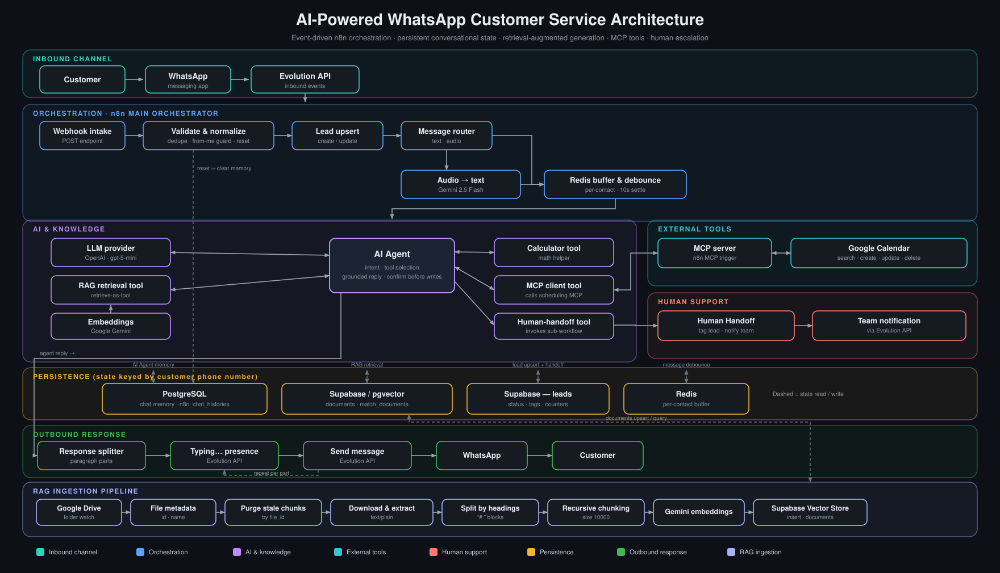

# AI WhatsApp Customer Service Agent

**A modular, event-driven AI customer-service architecture for WhatsApp, built on n8n.**
It receives text and voice messages, answers from a maintained knowledge base using
retrieval-augmented generation, manages appointments through calendar tools exposed
over the Model Context Protocol, keeps per-contact conversational state, tracks
leads, and hands off to a human agent through a dedicated escalation flow.


**Quick links:** [Architecture](#4-architecture-overview) · [How it works](#5-how-it-works) · [Workflow ecosystem](#6-workflow-ecosystem) · [Setup](#12-setup) · [Full spec »](docs/HOW_IT_WORKS.md) · [Architecture doc »](docs/ARCHITECTURE.md)

---

## 1. Positioning statement

This is not a simple WhatsApp chatbot. It is a modular AI customer-service
architecture that combines **event-driven workflow orchestration**, **per-contact
persistent conversational state**, **retrieval-augmented generation over a
maintained knowledge base**, **tool integration through the Model Context
Protocol**, **message buffering with debounce**, and a **deterministic
human-escalation path** — delivered as four independently deployable n8n
workflows with explicit interfaces between them.

---

## 2. Project overview

**Business problem.** Inbound customer service on WhatsApp is high-volume,
repetitive, and time-sensitive. Most questions are answerable from known company
information; many requests are appointment operations (book, reschedule, cancel);
a minority genuinely need a human. Handling all of this manually is slow and does
not scale, and a naive bot that "just calls an LLM" invents facts, loses context
between messages, and cannot take real actions.

**Implemented solution.** An n8n-based system where an LLM **agent** sits behind a
disciplined orchestration layer:

- inbound events are validated, de-duplicated, and normalized before anything else runs;
- rapid-fire message fragments are buffered and consolidated into a single turn;
- the agent answers **only** from retrieved knowledge or explicit tool results;
- appointment actions go through calendar **tools** and require customer confirmation;
- anything out of scope is routed to a human, after which automated replies stop.

**Role of the agent.** The agent is an orchestrated decision-maker, not the whole
system. It classifies intent, decides which tool to call, grounds its answer in
retrieved context or tool output, and produces the customer-facing reply. State,
delivery, knowledge ingestion, and escalation are handled by the surrounding
workflows.

**Operational benefits.** Repetitive questions and routine scheduling are handled
without human involvement; conversation context is preserved across messages and
sessions; the knowledge base can be updated by dropping a document in a folder;
and escalation to a human is deterministic and carries full context. *(No
volume, latency, deflection-rate, or accuracy figures are claimed — none are
measured in this repository.)*

---

## 3. Core capabilities

Only capabilities that are actually present in the workflow definitions are listed.

| Capability | How it is implemented |
|---|---|
| **WhatsApp customer service** | Inbound events via an Evolution API webhook; outbound replies and a "typing…" presence via Evolution API message nodes. |
| **Supported message types** | Text (`conversation`) and voice (`audioMessage`), separated by an explicit router. Other types are not handled. |
| **Audio transcription** | Voice notes are converted from base64 to binary and transcribed with a Gemini 2.5 Flash audio model before entering the agent. |
| **Message buffering & debounce** | Each fragment is pushed to a per-contact Redis list; after a 10-second wait the flow proceeds only if the last buffered message is unchanged, so bursts become one turn. |
| **Persistent conversational memory** | Chat history is stored in PostgreSQL, keyed by the contact's phone number, and is available to the agent as memory. |
| **Retrieval-augmented generation** | The agent has a Supabase vector-store retrieval tool (`retrieve-as-tool`) over a `documents` table, with Google Gemini embeddings. |
| **Knowledge ingestion** | A separate workflow watches a Google Drive folder and keeps the vector store in sync (idempotent re-ingestion per file). |
| **Tool integration via MCP** | Scheduling is a standalone MCP server; the main workflow consumes it through an MCP client tool. |
| **Appointment management** | Calendar tools for **search, create, update, and delete** events on a Google Calendar. |
| **Lead management** | Contacts are upserted into a Supabase `leads` table (name, phone, status, tags, message count, last interaction). |
| **Human handoff** | An agent tool invokes a sub-workflow that tags the lead and notifies the operations team with reason and context. |
| **Anti-hallucination rules** | The agent system prompt forbids inventing prices, services, hours, or availability, and requires consulting the knowledge base or deferring to the team. |
| **Confirmation before critical actions** | The prompt requires an explicit customer confirmation and a summary before any create / update / delete on the calendar. |
| **Post-handoff guard** | Once a lead is tagged for human service, the main workflow routes new messages to a memory-only branch instead of the agent. See [Limitations](#14-limitations-and-roadmap). |

---

## 4. Architecture overview

<p align="center">
  <a href="docs/images/architecture-overview.svg">
    
  </a>
</p>

<p align="center"><sub>Click the diagram to open it full size.</sub></p>

**Layers**

- **Inbound channel** — the customer, WhatsApp, and the Evolution API gateway that
  delivers events to n8n.
- **Orchestration (n8n main orchestrator)** — webhook intake, validation and
  normalization, lead upsert, text/audio routing, audio transcription, and the
  Redis buffer/debounce.
- **AI & knowledge** — the AI Agent plus its LLM, RAG retrieval tool, embeddings,
  calculator, MCP client tool, and human-handoff tool.
- **External tools** — the MCP server workflow and the Google Calendar operations
  behind it.
- **Human support** — the handoff sub-workflow: tag the lead, notify the team.
- **Persistence** — PostgreSQL (chat memory), Supabase/pgvector (knowledge),
  Supabase `leads` (lead store), Redis (per-contact buffer).
- **Outbound response** — response splitting, presence, and delivery back through
  Evolution API to the customer.
- **RAG ingestion pipeline** — a separate lane: Google Drive → extraction →
  chunking → embeddings → Supabase vector store.

A component-level walkthrough and Mermaid diagram are in
[`docs/ARCHITECTURE.md`](docs/ARCHITECTURE.md); the detailed technical
specification is in [`docs/HOW_IT_WORKS.md`](docs/HOW_IT_WORKS.md).

---

## 5. How it works

The journey of a single inbound message:

1. **Receive.** The WhatsApp provider POSTs a `messages.upsert` event to the main
   workflow's webhook.
2. **Normalize.** Phone number, push name, event type, message type, timestamp,
   optional base64 audio, and the `from_me` flag are extracted into a flat shape.
3. **Guard.** Messages sent by the business itself are stored as assistant memory
   and not reprocessed; only inbound messages continue.
4. **Reset check.** If the message equals the configured reset keyword, the
   contact's stored conversation memory is cleared and the turn ends.
5. **Lead upsert.** The contact is looked up in `leads`; created if new, otherwise
   its message count and last-interaction timestamp are updated.
6. **Route by type.** Text passes straight through; audio is converted to binary
   and transcribed to text.
7. **Handoff guard.** If the lead is tagged for human service, the message is
   recorded to memory only — the agent does not run.
8. **Buffer & debounce.** The message is appended to a per-contact Redis list;
   after a short wait the flow continues only if no newer message has arrived,
   then the buffered fragments are joined into one prompt.
9. **Agent turn.** The AI Agent runs with PostgreSQL memory and its tools
   (RAG retrieval, MCP calendar client, human-handoff, calculator), consulting the
   knowledge base and/or calling tools as needed, and asking for confirmation
   before any calendar write.
10. **Deliver.** The answer is split on blank lines into parts; for each part the
    workflow sends a "typing…" presence, sends the message, waits, and continues —
    or, if the agent escalated, the handoff sub-workflow tags the lead and
    notifies the team.

Full detail — state transitions, error paths, and per-component responsibilities —
is in [`docs/HOW_IT_WORKS.md`](docs/HOW_IT_WORKS.md).

---

## 6. Workflow ecosystem

The system is split into four workflows with distinct responsibilities and stable
interfaces: a **main orchestrator**, a **RAG ingestion** pipeline, an **MCP
server** for scheduling, and an independent **human handoff** flow.

| Workflow (file) | Responsibility | Trigger | Key integrations | Produces |
|---|---|---|---|---|
| **Main orchestrator**<br>[`workflows/ai-agent-main.json`](workflows/ai-agent-main.json) | End-to-end handling of an inbound message through to the outbound reply or escalation. | HTTP webhook (WhatsApp provider) | Evolution API, PostgreSQL, Supabase (`leads` + vector store), Redis, OpenAI, Google Gemini, MCP client, sub-workflow call | Customer replies on WhatsApp; updated lead and conversation memory; optional handoff |
| **RAG knowledge base ingestion**<br>[`workflows/rag-knowledge-base.json`](workflows/rag-knowledge-base.json) | Keep the vector store synchronized with a Drive folder. | Google Drive triggers (`fileCreated`, `folderUpdated`), polled every minute | Google Drive, Google Gemini embeddings, Supabase vector store | Chunked, embedded documents in the `documents` table with source metadata |
| **Calendar MCP tools**<br>[`workflows/calendar-mcp-tools.json`](workflows/calendar-mcp-tools.json) | Expose appointment operations as MCP tools. | n8n MCP trigger (server endpoint) | Google Calendar (OAuth2) | Event search / create / update / delete results returned to the calling agent |
| **Human handoff**<br>[`workflows/human-handoff.json`](workflows/human-handoff.json) | Flag a conversation for human service and alert the team. | Execute-sub-workflow trigger (called by the orchestrator) | Supabase (`leads`), Evolution API | Lead tagged for human service; WhatsApp notification with reason and context |

---

## 7. Architecture decisions

**Why Redis (buffer + debounce).** Customers often send a thought across several
quick messages. Without buffering, the agent would run once per fragment and reply
with partial context. A per-contact Redis list plus a short settle window
consolidates a burst into a single, complete prompt and suppresses duplicate
processing.

**Why persistent memory (PostgreSQL).** Conversation context must survive between
messages, across sessions, and across n8n restarts. Storing history in Postgres,
keyed by phone number, also makes the "reset" behavior a simple, explicit
delete rather than hidden in-process state.

**Why RAG is a separate workflow.** Ingestion cadence (documents change rarely,
in bursts) is unrelated to serving cadence (constant). Separating them lets the
knowledge base be updated — re-chunked and re-embedded — without touching or
redeploying the agent, and keeps the delete-then-reinsert idempotency logic out of
the request path.

**Why MCP for scheduling.** The agent calls a *capability* ("manage
appointments"), not a Google Calendar implementation. The calendar logic lives
behind an MCP server, so it can change independently and be reused by other MCP
clients without modifying the agent.

**Why handoff is its own flow.** Escalation is a distinct concern with its own
side effects (tagging, notifying). As a sub-workflow it is deterministic,
independently testable and reusable, and keeps the orchestrator focused on the
conversational path.

**Why four workflows.** Each can be imported, versioned, activated, and scaled on
its own; the interfaces between them (webhook, MCP endpoint, sub-workflow call,
shared `documents` table) are explicit and small.

---

## 8. Reliability and production-oriented concerns

This repository ships a **production-oriented architecture**, not a turnkey
production deployment. What is present:

- **Idempotent ingestion** — before inserting new chunks for a file, the pipeline
  deletes existing chunks with the same `file_id`, so re-processing replaces
  rather than duplicates.
- **Message buffering** — bursts are consolidated; the post-wait equality check
  prevents double processing of the same buffered state.
- **Per-contact state keys** — memory, buffer, and lead records are all keyed by
  phone number, isolating concurrent conversations.
- **Explicit message-type handling** — a router separates text and audio; the
  normalization step has a fallback chain for resolving the message text.
- **Confirmation before sensitive actions** — the agent prompt mandates a summary
  and explicit confirmation before any calendar create / update / delete.
- **Post-handoff guard** — tagged leads bypass the agent path (see caveat in
  [Limitations](#14-limitations-and-roadmap)).
- **Credential isolation** — no credentials or environment-specific identifiers
  are stored in the workflow JSON; see [`docs/SECURITY.md`](docs/SECURITY.md).

What is **not** included: an automated test suite, a global error-handling / retry
workflow, dead-letter handling, structured logging, metrics, tracing, or an
alerting layer. These would be required before calling any deployment
"production-ready".

---

## 9. Technology stack

| Technology | Responsibility | Architectural layer |
|---|---|---|
| **n8n** (+ LangChain nodes) | Workflow orchestration, agent runtime, tool wiring | Orchestration / AI |
| **Evolution API** | WhatsApp send / receive / presence | Inbound & outbound channel |
| **OpenAI** (`gpt-5-mini`) | Agent chat model | AI |
| **Google Gemini** (`gemini-2.5-flash`) | Audio transcription | Orchestration (pre-agent) |
| **Google Gemini embeddings** | Vectorization of documents and queries | AI / knowledge |
| **Supabase** (PostgreSQL + `pgvector`) | Vector store (`documents`) and lead table (`leads`) | Persistence |
| **PostgreSQL** | Conversational memory (`n8n_chat_histories`) | Persistence |
| **Redis** | Per-contact message buffer / debounce | Persistence |
| **Google Drive** | Source of knowledge-base documents | Knowledge ingestion |
| **Google Calendar** | Appointment storage and operations | External tools |
| **Model Context Protocol** (n8n MCP trigger + client) | Capability abstraction for scheduling | AI ↔ external tools |

> The shipped configuration uses OpenAI for the agent and Google Gemini for
> transcription and embeddings. These are provider choices encoded in the node
> parameters, not a built-in provider-switching feature.

---

## 10. Repository structure

```
.
├── README.md                     # this document
├── .env.example                  # expected environment variables (placeholders only)
├── .gitignore                    # excludes .env, secrets, credentials, raw data, logs, temp files
├── docs/
│   ├── ARCHITECTURE.md           # component walkthrough + Mermaid system diagram
│   ├── HOW_IT_WORKS.md           # detailed technical specification (message lifecycle, state, errors)
│   ├── SECURITY.md               # what was removed, how to supply config safely
│   ├── SETUP.md                  # prerequisites, import, credentials, activation order, smoke tests
│   └── images/
│       └── architecture-overview.svg   # hand-authored vector architecture diagram
└── workflows/
    ├── ai-agent-main.json        # main orchestrator
    ├── rag-knowledge-base.json   # RAG ingestion pipeline
    ├── calendar-mcp-tools.json   # MCP server: Google Calendar tools
    └── human-handoff.json        # human escalation sub-workflow
```

- **`workflows/`** — the four n8n workflow exports; import these into your instance.
- **`docs/`** — architecture, specification, security, and setup documentation.
- **`docs/images/`** — the architecture diagram, embedded in this README by
  relative path.
- **`.env.example`** — the full list of configuration variables the deployment
  needs; every value is a `YOUR_*` placeholder.

---

## 11. What is sanitized

The workflow JSON in this repository is **sanitized**. Removed and replaced with
`YOUR_*` placeholders: credential IDs and names, the n8n instance ID, workflow
version IDs, production hostnames and IPs, webhook and MCP endpoint identifiers,
Google Drive and Calendar IDs, the messaging instance name, phone numbers, all
pinned execution data, and company-specific prompt content (identity, pricing,
policies) — which is replaced by a neutral placeholder company. The only
identifiers left are n8n's internal structural node IDs, which carry no secret or
personal data. Details: [`docs/SECURITY.md`](docs/SECURITY.md).

---

## 12. Setup

Full instructions: [`docs/SETUP.md`](docs/SETUP.md). In short:

**Prerequisites** — n8n (with the LangChain / AI nodes, MCP trigger and MCP client
nodes); Evolution API or an equivalent WhatsApp API; PostgreSQL; Supabase (with
`pgvector`, the `documents` table and a `match_documents` function); Redis; Google
Drive and Google Calendar (OAuth2); an LLM provider; an embeddings provider.

**Steps**

1. `cp .env.example .env` and fill in your own values (never commit `.env`).
2. In n8n, create one credential per external system (WhatsApp/Evolution,
   PostgreSQL, Supabase, Redis, Google Drive, Google Calendar, LLM, embeddings).
3. Import the four workflows from `workflows/`.
4. Replace every `YOUR_*` placeholder and re-link credentials on each node
   (regenerate the webhook and the MCP trigger; set the Drive folder ID, the
   Calendar ID, the messaging instance, the notification number, the sub-workflow
   ID, the reset keyword).
5. Adapt the AI Agent system prompt to your company (identity, flows, policies).

**Recommended activation order**

1. `calendar-mcp-tools.json` → copy its MCP endpoint URL.
2. `rag-knowledge-base.json` → add a document to the Drive folder, confirm chunks
   land in `documents`.
3. `human-handoff.json`.
4. `ai-agent-main.json` → wire the MCP client and handoff tool, then activate and
   point the WhatsApp webhook at it.

**Basic test** — send a knowledge-base question (expect a grounded answer), a
voice note (expect transcription + reply), a booking request followed by a
confirmation (expect a calendar event), and a "talk to a human" request (expect
the lead tagged and the team notified, with automated replies stopping).

---

## 13. Security

- No credentials, tokens, or environment-specific identifiers are versioned. All
  configuration is supplied at deploy time through the n8n credential store and
  environment variables — never inside the workflow JSON.
- `.env` and `*.env` files are git-ignored; only `.env.example` (placeholders) is
  tracked.
- Contributor rules, the full list of removed data, and operational hardening
  notes are in [`docs/SECURITY.md`](docs/SECURITY.md).

---

## 14. Limitations and roadmap

### Current functionality
Everything described in [Core capabilities](#3-core-capabilities) is implemented in
the workflows in this repository.

### Known limitations
- **Handoff tag mismatch (unverified).** The handoff sub-workflow writes the lead
  tag `"Atendimento Humano"`, while the main workflow's post-handoff guard checks
  for `"atendimento_humano"`. As shipped, the guard condition may not match the
  value the handoff sets; this should be verified and aligned in a real
  deployment. *(Not changed here — this task does not modify workflow behavior.)*
- **Single instance assumptions.** The nodes target one WhatsApp instance, one
  Google Calendar, and one Drive folder.
- **Message types.** Only text and voice are handled; images, documents,
  locations, and interactive messages are not.
- **Prompt language and content.** The agent prompt is Portuguese-oriented and
  uses a placeholder company; it must be rewritten per deployment.
- **Reset keyword.** It is a plain configurable string, not access-controlled.
- **No test / observability layer.** See
  [Reliability](#8-reliability-and-production-oriented-concerns).

### Possible future work (not implemented)
- Automated workflow tests and a CI check.
- A global error-handling / retry / dead-letter workflow.
- Structured logging, metrics, and alerting.
- Multi-instance / multi-calendar / multi-tenant support.
- Additional inbound media types (image, document, location).
- Prompt and business rules driven by configuration instead of inline text.
- An operator dashboard for leads and handoffs.

*These are candidate improvements, not delivered features.*

---

## 15. Author

**Murilo Guimarães Costa** — IT Project Specialist ("Especialista em Projetos de
TI") moving into AI Engineering.

This project reflects work on **solution architecture**, **workflow and process
modeling**, **systems integration**, **business-rule design**, and the **practical
application of AI** (agent orchestration, RAG, tool/MCP integration, safety
constraints) — rather than conventional application development. The emphasis is on
designing how the pieces fit together, how state and control flow through the
system, and how to keep an AI-driven service grounded, controllable, and safe to
operate.

GitHub: [@Murilo58](https://github.com/Murilo58)
