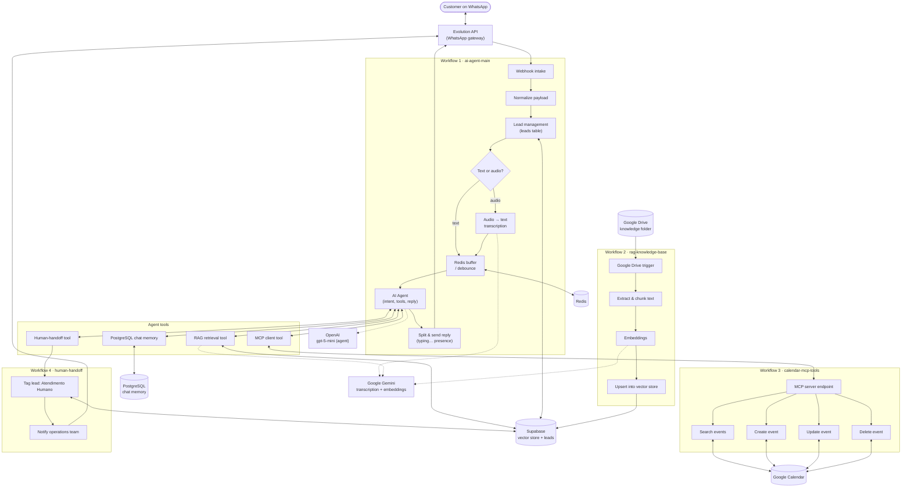

# Architecture

**Docs:** [README](../README.md) · **Architecture** · [How It Works](HOW_IT_WORKS.md) · [Security](SECURITY.md) · [Setup](SETUP.md)

The solution is split into **four n8n workflows**. Each has a single
responsibility and a stable interface, so they can be deployed and evolved
independently. For a rendered, layered view see
[`images/architecture-overview.svg`](images/architecture-overview.svg); for the
node-level specification see [`HOW_IT_WORKS.md`](HOW_IT_WORKS.md).

| Workflow | File | Responsibility | Interface exposed |
|----------|------|----------------|-------------------|
| Main orchestrator | `workflows/ai-agent-main.json` | End-to-end handling of an inbound WhatsApp message up to the outbound reply. | Inbound HTTP webhook (from the WhatsApp provider). |
| RAG knowledge base ingestion | `workflows/rag-knowledge-base.json` | Keep the vector store in sync with a Google Drive folder. | Google Drive triggers (file created / folder updated). |
| Calendar MCP tools | `workflows/calendar-mcp-tools.json` | Expose appointment operations as MCP tools. | MCP server endpoint (n8n MCP trigger). |
| Human handoff | `workflows/human-handoff.json` | Flag a conversation for human service and notify the team. | Execute-sub-workflow trigger (called by the main workflow). |

---

## 1. Main orchestrator (`ai-agent-main.json`)

Pipeline:

1. **Webhook** receives the provider event (`messages.upsert`).
2. **Field mapping** normalizes the payload (phone, push name, event, message
   type, timestamp, base64 audio, `from_me`, instance).
3. **Merge + guards**: ignore messages sent by the business itself; keep only
   inbound messages.
4. **Reset check**: an operator-defined keyword clears the stored conversation
   memory for that contact.
5. **Lead management**: look up the contact in the `leads` table; create it if
   new, otherwise increment the message count and refresh `last_interaction`.
6. **Message-type router**:
   - text → passed straight through;
   - audio → base64 → binary → transcription (Gemini 2.5 Flash).
7. **Human-service check**: if the lead is tagged for human service, the AI path
   is skipped.
8. **Debounce buffer (Redis)**: incoming fragments are pushed to a per-contact
   list; after a short wait the workflow checks whether the last buffered message
   is stable before processing, so rapid-fire messages are consolidated into one
   turn.
9. **AI Agent** runs with:
   - a chat LLM (OpenAI `gpt-5-mini`),
   - **PostgreSQL chat memory** (session key = contact phone),
   - the **RAG retrieval tool** (Supabase vector store + Google Gemini embeddings),
   - the **MCP client tool** (calendar operations),
   - the **human-handoff sub-workflow tool**,
   - a calculator tool.
10. **Response shaping**: the answer is split on blank lines into multiple
    WhatsApp messages, sent one by one with a "typing…" presence and a short wait
    between parts.

## 2. RAG knowledge base ingestion (`rag-knowledge-base.json`)

1. **Google Drive triggers** watch a specific folder for new or updated files.
2. **Set** captures `file_id` and `file_name`.
3. **Delete previous chunks** for that `file_id` in the vector store (idempotent
   re-ingestion).
4. **Download + extract text** from the file (Google Docs converted to `text/plain`).
5. **Split by separator** (custom code splits on `# ` headings) then the
   **recursive character text splitter** (`chunkSize: 10000`) chunks the content.
6. **Embeddings** are generated (Google Gemini) and the chunks are **inserted into
   the Supabase vector store** — after step 3 deletes the file's previous chunks,
   so re-ingestion is idempotent — with metadata (`file_id`, `file_name`,
   `source`).

The main workflow's RAG tool reads from the same `documents` table, so ingestion
and retrieval are fully decoupled.

## 3. Calendar MCP tools (`calendar-mcp-tools.json`)

- An **MCP trigger** publishes an MCP server endpoint.
- Four **Google Calendar tool** nodes are attached to it:
  - **search events** (availability lookup),
  - **create event**,
  - **update event**,
  - **delete event**.
- Tool parameters are filled by the calling agent (`$fromAI` overrides).

The main workflow consumes this endpoint through an **MCP client tool**, so the
agent never talks to Google Calendar directly — the scheduling implementation can
change without touching the agent.

## 4. Human handoff (`human-handoff.json`)

Invoked by the agent as a tool with `Motivo`, `Contexto`, and `Telefone`:

1. **Update the lead** — set `Tags` to `["Atendimento Humano"]` on the Supabase
   `leads` row.
2. **Notify the team** — send a WhatsApp message with the reason and full context
   to the operations number.

On the next inbound message the main workflow's handoff guard checks the lead's
tags and routes to a memory-only branch, so the agent stops answering.

> **Inconsistency (unverified):** the guard checks for the tag value
> `atendimento_humano` (underscored, lower case) while this workflow writes
> `Atendimento Humano` (spaced, title case). As shipped these may not match; this
> is documented in [`HOW_IT_WORKS.md` §13](HOW_IT_WORKS.md#13-lead-management) and
> left unchanged.

---

## How the workflows communicate

| From | To | Mechanism |
|------|----|-----------|
| WhatsApp provider | Main orchestrator | HTTP webhook |
| Main orchestrator | Human handoff | n8n execute-sub-workflow (tool) |
| Main orchestrator | Calendar MCP tools | MCP client → MCP server endpoint |
| RAG ingestion ↔ Main orchestrator | (indirect) | Shared Supabase `documents` vector table |
| Main orchestrator (self) | Per-contact state | Redis buffer + PostgreSQL chat memory + Supabase `leads` |
| Google Drive | RAG ingestion | Google Drive polling triggers |
| Calendar MCP tools | Google Calendar | Google Calendar API (OAuth2) |

> Persistence note: conversation history uses the **PostgreSQL** node
> (`n8n_chat_histories`); the `leads` table and the vector store use the
> **Supabase** node. Supabase is Postgres-backed, but they are distinct
> credentials and nodes in these workflows.

---

## System diagram

---

## Design principles

- **Separation of concerns** — messaging, reasoning, knowledge ingestion, and
  scheduling are independent workflows.
- **Tool abstraction via MCP** — the agent calls capabilities, not
  implementations.
- **Stateful per contact** — memory and lead data are keyed by phone number.
- **Idempotent ingestion** — re-processing a document replaces its chunks instead
  of duplicating them.
- **Safety first** — anti-hallucination instructions and mandatory confirmation
  before any create/update/delete on the calendar.
- **Human in the loop** — deterministic escalation path with full context
  forwarded to the team.

---

**Docs:** [README](../README.md) · **Architecture** · [How It Works](HOW_IT_WORKS.md) · [Security](SECURITY.md) · [Setup](SETUP.md)
