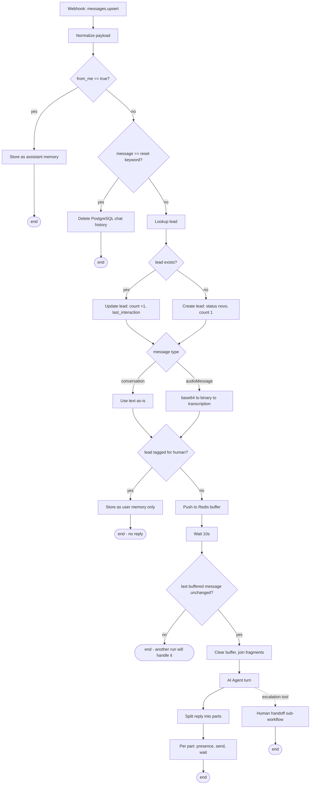
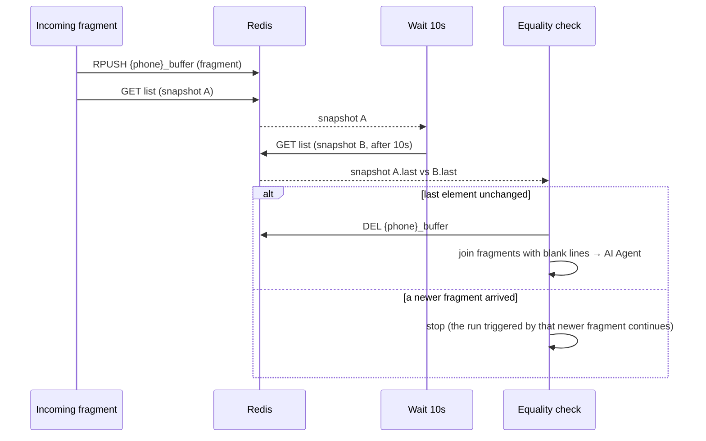
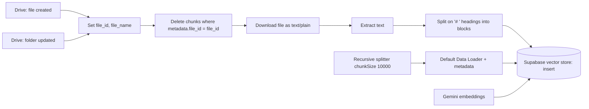
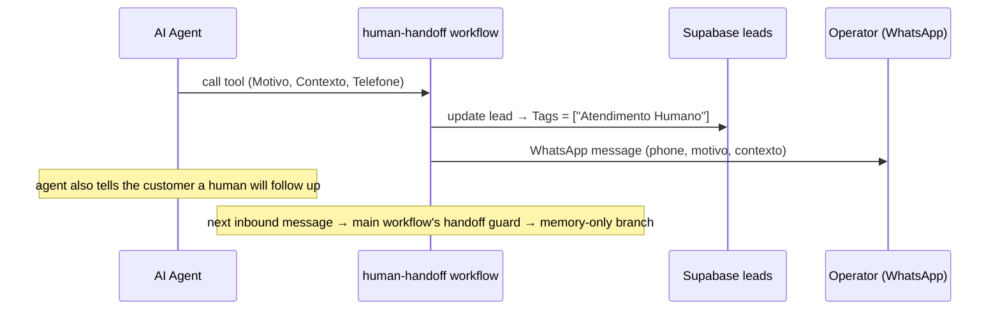
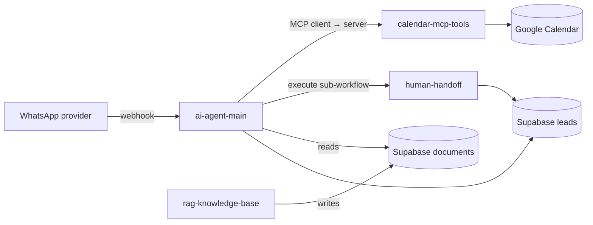

# How It Works — Technical Specification

**Docs:** [README](../README.md) · [Architecture](ARCHITECTURE.md) · **How It Works** · [Security](SECURITY.md) · [Setup](SETUP.md)

This document describes the system as implemented in the four workflow files under
[`../workflows/`](../workflows/). Where a detail cannot be confirmed from those
files, it is called out explicitly.

---

## 1. Purpose and scope

The system automates first-line customer service on WhatsApp for a single
business: it answers questions from a maintained knowledge base, performs
appointment operations on a calendar, keeps per-contact conversation history, and
escalates to a human when required.

**In scope:** inbound text and voice messages, knowledge retrieval, appointment
search/create/update/delete, lead tracking, human handoff, outbound message
delivery, knowledge-base ingestion from a document folder.

**Out of scope (not in the workflows):** images/documents/location/interactive
messages, payments, multi-tenant routing, analytics, automated testing, and any
alerting or observability layer.

---

## 2. System actors

| Actor | Description |
|---|---|
| **Customer** | A person messaging the business number on WhatsApp. |
| **Business / operator** | The account that owns the WhatsApp number; also receives handoff notifications. |
| **AI Agent** | The LLM-driven decision component inside the main workflow. |
| **Knowledge maintainer** | Whoever adds or edits documents in the watched Google Drive folder. |
| **External services** | Evolution API, OpenAI, Google Gemini, Supabase, PostgreSQL, Redis, Google Drive, Google Calendar. |

---

## 3. Component responsibilities

| Component | Responsibility | Where |
|---|---|---|
| **Webhook intake** | Receive `messages.upsert` events. | `ai-agent-main` → `Webhook` |
| **Normalization** | Flatten the provider payload into stable fields. | `ai-agent-main` → `Dados` |
| **From-me guard** | Route business-sent messages to memory; keep inbound only. | `EnviadaPorMim`, `Filter` |
| **Reset check** | Clear conversation memory on a keyword. | `Reset?`, `DeletarMemória` |
| **Lead upsert** | Create or update the contact record. | `BuscarLead`, `LeadExiste?`, `CriarLead`, `AtualizarLead` |
| **Message router** | Split text vs. audio handling. | `TipoMensagem` |
| **Audio transcription** | base64 → binary → text. | `Base64`, `CoverterBase64`, `TranscreverAudio`, `MensagemAudio` |
| **Handoff guard** | Skip the agent for tagged leads. | `AtendimentoHumano` |
| **Buffer & debounce** | Consolidate bursts into one turn. | `AddMensagemBuffer`, `BuscarBuffer`, `Aguardar`, `BuscarBuffer1`, `Iguais?`, `LimparBuffer`, `MensagemFinal` |
| **AI Agent** | Intent, tool calls, grounded reply. | `AI Agent` (+ model, memory, tools) |
| **Response delivery** | Split, presence, send, loop. | `QuebrarMensagem`, `Iterar`, `Digitando...`, `Enviar Resposta`, `Wait` |
| **RAG ingestion** | Keep the vector store in sync with Drive. | `rag-knowledge-base` (all nodes) |
| **MCP scheduling server** | Expose calendar tools. | `calendar-mcp-tools` (all nodes) |
| **Human handoff** | Tag lead + notify team. | `human-handoff` (all nodes) |

---

## 4. End-to-end message lifecycle

---

## 5. Text-message processing

1. `TipoMensagem` matches `message_type == "conversation"`.
2. `MensagemTexto` sets `message` from the normalized `Merge` value
   (`body.data.message.conversation`).
3. Flow continues to the handoff guard and then the buffer.

No transformation beyond field selection is applied to text messages.

---

## 6. Audio-message processing

1. `TipoMensagem` matches `message_type == "audioMessage"`.
2. `Base64` copies the base64 audio captured during normalization
   (`body.data.message.base64`, defaulted to empty string).
3. `CoverterBase64` (`convertToFile`, `toBinary`) turns the base64 string into a
   binary attachment.
4. `TranscreverAudio` (`@n8n/n8n-nodes-langchain.googleGemini`, `resource: audio`,
   model `models/gemini-2.5-flash`, `inputType: binary`) transcribes it.
5. `MensagemAudio` maps the transcription into `content.parts[0].text`.
6. Flow continues to the handoff guard and then the buffer, where
   `NormalizarMensagem` resolves the final text (see §16 for the fallback chain).

> The base64 audio is expected on the inbound webhook payload. If the provider
> does not include it, `base64` is an empty string and transcription has nothing
> to work with.

---

## 7. Message buffering and debounce

Purpose: a customer often sends one message as several quick fragments. The buffer
turns a burst into a single agent turn and prevents the agent running once per
fragment.

Mechanics in the workflow:

- `AddMensagemBuffer` — Redis `push` to list `{Telefone}_buffer`, `tail: true`.
- `BuscarBuffer` — Redis `get` of the list (snapshot A).
- `Aguardar` — `Wait`, `amount: 10` (seconds).
- `BuscarBuffer1` — Redis `get` again (snapshot B).
- `Iguais?` — compares `BuscarBuffer1.messages.last()` to
  `BuscarBuffer.messages.last()`.
  - **equal** → `LimparBuffer` (Redis `delete`) → `MensagemFinal`
    (`messages.join("\n\n")`) → `AI Agent`.
  - **not equal** → `No Operation, do nothing` — this run ends; the run started by
    the newer fragment owns the turn.

Keyed by phone number, so concurrent conversations do not interfere.

---

## 8. Conversation memory

- **Store:** PostgreSQL, via `@n8n/n8n-nodes-langchain.memoryPostgresChat`, table
  `n8n_chat_histories`, `sessionIdType: customKey`, `sessionKey` = the contact's
  phone number.
- **Writes:**
  - Business-sent messages (`from_me == true`) are inserted as **assistant**
    messages by `Chat Memory Manager1` / `MemoriaPostgres1`.
  - When a lead is tagged for human service, the inbound message is inserted as a
    **user** message by `Chat Memory Manager` / `MemoriaPostgres`, with no reply.
  - During a normal agent turn, the agent's own `Postgres Chat Memory` handles
    reading and writing history for that turn.
- **Reset:** if the inbound message equals the configured reset keyword,
  `DeletarMemória` runs a Postgres `deleteTable` on `n8n_chat_histories` filtered
  by `session_id = <phone>`, and the turn ends.

---

## 9. AI-agent decision process

Node: `AI Agent` (`@n8n/n8n-nodes-langchain.agent`), `promptType: define`, user
text = the joined buffered message, plus a system prompt.

**Attached capabilities**

| Wiring | Node | Function |
|---|---|---|
| `ai_languageModel` | `OpenAI Chat Model` (`gpt-5-mini`) | Reasoning + reply generation |
| `ai_memory` | `Postgres Chat Memory` (session = phone) | Prior conversation context |
| `ai_tool` | `Supabase Base de Conhecimento Vector Store` (`retrieve-as-tool`, table `documents`) + `Embeddings Google Gemini` | Knowledge retrieval (RAG) |
| `ai_tool` | `MCP Gerenciar Agendamento Client` (`mcpClientTool`) | Calendar operations via the MCP server |
| `ai_tool` | `Call n8n Workflow Escalar Humano Tool` (`toolWorkflow`) | Human handoff (inputs `Motivo`, `Contexto`, `Telefone`) |
| `ai_tool` | `Calculator` | Arithmetic |

**System prompt (sanitized, generic).** The prompt defines: assistant identity and
a placeholder company; dynamic context (current time, customer name, phone); an
internal chain-of-thought checklist (intent → information → immediate action →
validation → confirmation); WhatsApp tone and formatting rules; four service flows
(questions, book, cancel, reschedule); and hard rules:

- **Tool execution:** never say "let me check" without calling the tool in the
  same response; consult the knowledge base before answering questions about the
  business; one tool at a time.
- **Anti-hallucination:** never invent prices, services, hours, or information;
  never confirm availability without the search tool; defer to the team when the
  knowledge base has no answer.
- **Mandatory confirmation:** always show a summary and get an explicit customer
  confirmation before creating, updating, or deleting an appointment.
- **Escalation triggers:** explicit request, serious complaint, sensitive topic
  (health/allergy), price negotiation, legal/financial complexity, or three
  failed attempts.

**Output.** The agent returns `output` (a string), which the delivery stage
splits and sends.

---

## 10. RAG ingestion pipeline

Workflow: `rag-knowledge-base.json`.

Step by step:

1. **Triggers.** `ArquivoCriado` (`fileCreated`) and `ArquivoAtualizado`
   (`folderUpdated`) watch one folder, polled every minute.
2. **`Dados`** captures `file_id` (`$json.id`) and `file_name` (`$json.name`).
3. **`DeletarAntigos`** deletes rows in `documents` where
   `metadata->>file_id = <file_id>` — this makes re-ingestion idempotent.
   `alwaysOutputData` is set so the flow proceeds even when nothing was deleted.
4. **`BaixarArquivo`** downloads the file, converting Google Docs to `text/plain`.
5. **`Extract from File`** extracts the text content.
6. **`IdentificaSeparador`** (code) splits the text on `\n# ` (markdown H1
   headings) into blocks, trims them, drops empties, and re-prefixes `# ` where
   needed — producing a `documents` array of heading-delimited sections.
7. **`Supabase Vector Store`** (`mode: insert`, table `documents`,
   `queryName: match_documents`) writes the chunks, using:
   - `Default Data Loader` — `jsonData` = the `documents` array, with metadata
     `file_id`, `file_name`, `source = "google_drive"`;
   - `Recursive Character Text Splitter` — `chunkSize: 10000`, applied inside the
     loader;
   - `Embeddings Google Gemini` — vectorization.

So splitting happens twice: coarse by heading, then by the 10000-character
recursive splitter.

---

## 11. RAG retrieval flow

During an agent turn:

1. The agent decides a business question needs grounding and calls the retrieval
   tool (`Supabase Base de Conhecimento Vector Store`, `mode: retrieve-as-tool`).
2. The query is embedded with `Embeddings Google Gemini`.
3. Supabase runs the similarity search against `documents` and returns matching
   chunks.
4. The agent composes an answer from the returned content, per the
   anti-hallucination rules; if nothing relevant is returned, it tells the
   customer it will check with the team.

Ingestion (§10) and retrieval share only the `documents` table — they are
otherwise decoupled.

---

## 12. Calendar / MCP operations

**Server** — `calendar-mcp-tools.json`, node `MCP Agendamento`
(`@n8n/n8n-nodes-langchain.mcpTrigger`). Four Google Calendar tool nodes are
attached to it:

| Tool node | Operation | Agent-supplied parameters (`$fromAI`) |
|---|---|---|
| `BuscarEvento` | `getAll` (search / availability) | `Limit`, `After` (timeMin), `Before` (timeMax) |
| `Create an event in Google Calendar` | create | `Start`, `End`, `Description`, `Summary` |
| `AtualizarEvento` | `update` | `Event_ID`, `Start`, `End`, `Description`, `Summary` |
| `DeletarEvento` | `delete` | `Event_ID` |

**Client** — in `ai-agent-main.json`, node `MCP Gerenciar Agendamento Client`
(`mcpClientTool`) points at the MCP server endpoint and is exposed to the agent as
a single tool. The agent never calls Google Calendar directly.

All four tool nodes use one Google Calendar (`cachedResultName: "Company
Scheduling Calendar"`, value is a placeholder) and one OAuth2 credential.

---

## 13. Lead management

Table: Supabase `leads`.

| Step | Node | Effect |
|---|---|---|
| Lookup | `BuscarLead` | `get` by `Telefone` (`alwaysOutputData`) |
| Branch | `LeadExiste?` | true if `created_at` exists |
| Update | `AtualizarLead` | by `id`: `last_interaction = now (ISO)`, `message_count = message_count + 1` |
| Create | `CriarLead` | `Telefone`, `Nome`, `message_count = 1`, `status = "novo"` |
| Tag (handoff) | `human-handoff` → `Update a row` | by `Telefone`: `Tags = ["Atendimento Humano"]` |
| Guard read | `AtendimentoHumano` | checks `BuscarLead.Tags` contains `"atendimento_humano"` |

> **Inconsistency (unverified):** the handoff writes the tag as
> `"Atendimento Humano"` (spaced, title case) but the guard checks for
> `"atendimento_humano"` (underscored, lower case). As shipped these may not
> match. This is documented, not fixed — this task does not change workflow
> behavior.

---

## 14. Human handoff lifecycle

1. The agent calls `Call n8n Workflow Escalar Humano Tool` with a reason
   (`Motivo`), context (`Contexto`), and the customer's phone (`Telefone`).
2. `human-handoff` → `Executado` receives those inputs.
3. `Update a row` tags the lead in Supabase.
4. `AvisarHumano` sends a formatted WhatsApp message to the operator number via
   Evolution API:
   `*Atendimento Humano Solicitado* / Telefone / Motivo / Contexto`.
5. On the next inbound message, `AtendimentoHumano` in the main workflow sees the
   tag and routes to the memory-only branch — the agent does not reply again
   (subject to the tag-value caveat in §13).

There is no automated "un-handoff" step in the workflows; clearing the tag is a
manual/operator action.

---

## 15. Response delivery

1. **`QuebrarMensagem`** (code) takes the agent's `output` string and splits it on
   two-or-more newlines into parts `[{ message, part, total }]`. If `output` is
   missing or not a string, it returns a single empty part; if no split points are
   found, it returns the whole text as one part.
2. **`Iterar`** (`splitInBatches`) iterates the parts.
3. For each part: **`Digitando...`** sends a WhatsApp "typing…" presence
   (Evolution API `chat-api` `send-presence`, `delay: 3000`) to
   `Merge.wpp_id`, then **`Enviar Resposta`** sends the part
   (Evolution API `messages-api`) to the same recipient.
4. **`Wait`** pauses briefly, then control returns to `Iterar` for the next part.
5. When parts are exhausted, `splitInBatches` completes and the flow ends.

---

## 16. State transitions

**Lead status / tags**

| From | Event | To |
|---|---|---|
| (none) | first inbound message | lead created, `status = "novo"` |
| existing lead | any inbound message | `message_count += 1`, `last_interaction` updated |
| any lead | agent calls handoff tool | `Tags` includes the human-service tag |
| tagged lead | new inbound message | routed to memory-only branch (no agent) |
| tagged lead | operator clears the tag (manual) | normal agent path resumes |

**Per-turn control state**

| State | Held in | Cleared |
|---|---|---|
| Conversation history | PostgreSQL `n8n_chat_histories` (key = phone) | reset keyword |
| Pending message burst | Redis list `{phone}_buffer` | `LimparBuffer` after a successful debounce check |
| Outbound iteration | `splitInBatches` runtime state | when all parts are sent |

---

## 17. Error and fallback scenarios

What the workflows do:

- **Message-text resolution fallback.** `NormalizarMensagem` sets
  `message = $json.message ?? $json.text ?? $json.content?.parts?.[0]?.text ?? $('TranscreverAudio').item.json.text`,
  covering text, transcription, and alternate shapes.
- **Empty / non-string agent output.** `QuebrarMensagem` returns a single empty
  part instead of throwing.
- **Missing lead on lookup.** `BuscarLead` and `DeletarAntigos` use
  `alwaysOutputData`, so downstream nodes still run.
- **Debounce race.** The `Iguais?` check ends duplicate runs cleanly via
  `No Operation`.

What is **not** present:

- No global error-handling workflow, no per-node `continueOnFail` strategy, no
  retry/backoff configuration, no dead-letter queue.
- No explicit handling for provider/API failures (Evolution, OpenAI, Gemini,
  Supabase, Google) — a failing node fails the execution.
- No timeout handling around the buffer wait beyond the equality check.

Treat error handling as a gap to close before production use.

---

## 18. Security boundaries

- **Credentials** live only in the n8n credential store; the workflow JSON
  references them by placeholder ID/name. Nothing secret is in this repository.
- **Environment-specific identifiers** (webhook ID, MCP endpoint, Drive folder
  ID, Calendar ID, messaging instance, operator phone number) are placeholders to
  be set per deployment.
- **Trust surface:** the inbound webhook accepts whatever the WhatsApp provider
  POSTs — the `from_me` guard and reset check run on that input; the MCP endpoint
  and webhook IDs should be treated as secrets.
- **Data at rest:** conversation content, lead PII, and knowledge chunks live in
  PostgreSQL / Supabase / Redis under the operator's control; scope keys and
  service accounts to least privilege.
- Full detail: [`SECURITY.md`](SECURITY.md).

---

## 19. Workflow dependencies

- `ai-agent-main` depends on `calendar-mcp-tools` (must be active, endpoint URL
  wired) and `human-handoff` (must be imported, workflow ID wired).
- `ai-agent-main` and `rag-knowledge-base` are coupled only through the Supabase
  `documents` table.
- `rag-knowledge-base` and `calendar-mcp-tools` have no dependency on each other.

Recommended activation order: `calendar-mcp-tools` → `rag-knowledge-base` →
`human-handoff` → `ai-agent-main` (see [`SETUP.md`](SETUP.md)).

---

## 20. Known limitations

- **Handoff tag value mismatch** between writer and guard (§13) — verify and align.
- **Single WhatsApp instance, single calendar, single Drive folder** are assumed.
- **Only text and audio** inbound messages are handled.
- **No automated tests, error-handling workflow, logging, metrics, or alerting.**
- **Agent prompt** is Portuguese-oriented and uses a placeholder company; it must
  be rewritten per deployment.
- **Reset keyword** is a plain string with no access control.
- **`Wait` node** in the delivery loop has no explicit interval configured in the
  file; it relies on the node's default behavior.
- **Base64 audio** must be present on the inbound payload for transcription to
  work.

---

**Docs:** [README](../README.md) · [Architecture](ARCHITECTURE.md) · **How It Works** · [Security](SECURITY.md) · [Setup](SETUP.md)
